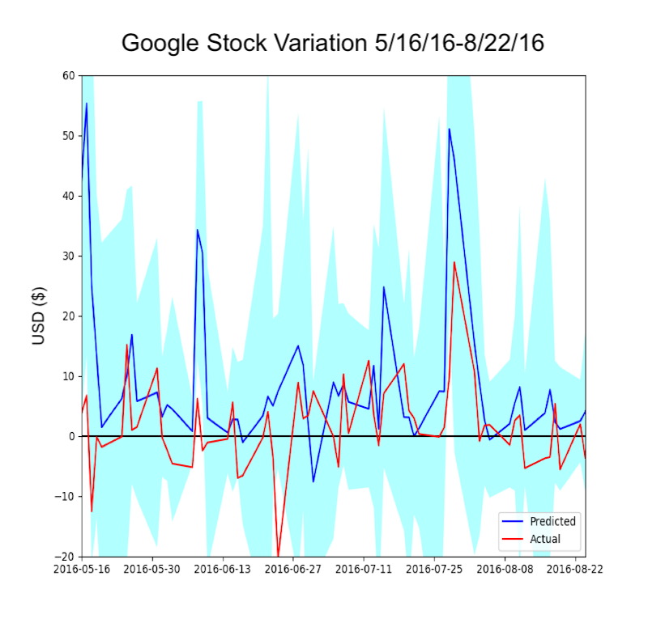

----------------------------------------------------------------------------------------------------
Overview
----------------------------------------------------------------------------------------------------
This program uses news headlines correlated with 
fluctuations in stock prices in order to learn the
effect of news on stocks. It obtains its news by
scraping ProQuest, a collection of news databases
available online. It then analyzes the significance 
behind every word by employing a term frequency-
inverse document frequency algorithm. Then, this 
program cross references every news headline with
every price fluctuation that occurred within a
given time period. This program attributes a
percentage of every price fluctuation to the words
that appeared in the news that day. This percentage
is based on the significance of that word. Finally,
it calculates the average fluctuation attributed to
every word along with a 95% confidence interval. This
allows us to make conjectures on how future news will
impact prices, assuming this program was trained
using a large time period and resulted in tight
confidence intervals.

----------------------------------------------------------------------------------------------------
Dependencies
----------------------------------------------------------------------------------------------------
This program requires Python 2.71 with the following packages:
	nltk
	numpy
	scipy
	sklearn
	urllib
	matplotlib
	json
This program potentially requires you to be on RIT's network 
in order to bypass the ProQuest authentication filter

----------------------------------------------------------------------------------------------------
Execution
----------------------------------------------------------------------------------------------------
This program is started by running:
learn(string companyName, string companySymbol, date startDate, date endDate)
A sample run is included in the script. This run would
train the program based on Google's stock performace
over a period of 10 years, from 08/20/2004 to 12/31/2015. 
Downloading the data from ProQuest takes a long time, 
so this program caches all successful downloads using 
the naming scheme:
'news_%companyName%_%startDate%-%endDate%.json'
The script checks for the presence of this file
to avoid redownloading the same data set multiple times.
Because it takes so long to download, this program
also displays every day's worth of news it's completed
downloading so the user has visual confirmation
that it's running.
I included a cached version of the downloaded news to use
for the included sample code in case you aren't on
a RIT's campus.
The program's output is a file saved with the name:
'output_%companyName%_%startDate%-%endDate%.json'
This file contains every word the program learned
throughout its training. Every word is followed by
3 floating point numbers. The first number represents
the average impact this word had on stock prices.
The second two numbers are the 95% confidence interval
for the calculated average. Therefore, a word with a
small confidence interval range will be more
trustworthy.

----------------------------------------------------------------------------------------------------
Altering Execution
----------------------------------------------------------------------------------------------------
By default, this program will scrape 10 databases out
of ProQuest's 65 available databases. Additional
or fewer databases can be scraped by commenting or
uncommenting values from the databases array.

Every word in every headline has non-alphabetical
characters removed and is stemmed. This leads to more
consistent training but results in less human-readable
outputs. Stemming and parsing can be disabled by 
using the alternate dailyHeadlines[...].append(...)
located in the getNews() method.

Some code changes may not be reflected if there's a cached 
version of the news previously download. 
Delete the 'news_XXXX.json' file created in the same 
directory as the python file to ensure this program
runs without any cached data.
